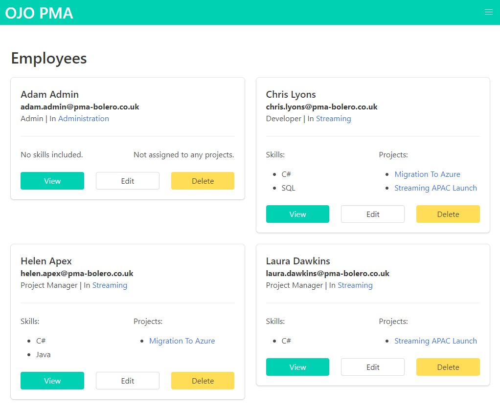

# PMA Bolero - WASM Web Application

[Live version of the website](https://pmaboleroserver.azurewebsites.net/)

This is an toy web application for the management of projects. The website specification is based upon a coursework project for Cloud Application Development at the University of Southampton, originally build in Angular.

The aim of the development of this project was see the benefits and pitfalls of [Bolero](https://fsbolero.io/) by using a project I understood well.

## Build Project

You will need:

- [.NET Core 3.1](https://dotnet.microsoft.com/download)

To run the application locally, run the command `dotnet run -p src/PmaBolero.Server`. Within Visual Studio Code (or an application that supports vscode tasks), the task `run server` runs the aforementioned command.

## Lessons

### MVU

Model-View-Update is productive and possibly my favourite code structure for building UIs. As I've often found with inherently functional ways of programming, MVU more closely aligns with my thought process for programming. MVU allowed me to spend more time thinking about what I wanted out of the website, and less about how to connect all the parts of the code to get it work.

The messaging system can become a bit convoluted, especially using the parent-child methodology I employed. I could see this quickly become difficult to use for a much large web application. In exchange, however, each part of the website could be built in near isolation.

### F# and Bolero

[F#](https://fsharp.org/) and [Bolero](https://fsbolero.io/) are promising ways of building web applications. Unlike with Angular development, most of the problems I encountered were spotted through the type system before running the server. I intentionally used templating rather than the more Elmish style of writing the UI in code to more closely match my experience with Angular. I am certain I will be using Bolero more in the future and for personal/small projects it will be my go to over Angular.

### Azure

Deploying to [Azure App Service](https://azure.microsoft.com/en-gb/services/app-service/) and setting up CD using [Azure Pipelines](https://azure.microsoft.com/en-gb/services/devops/pipelines/) was surprisingly simple using Visual Studio 2019. The automated process for setting up Azure was the only aspect that required further configuration:

- It only looked for .csproj projects.
- It attempted to drop the release of the client rather than server.
